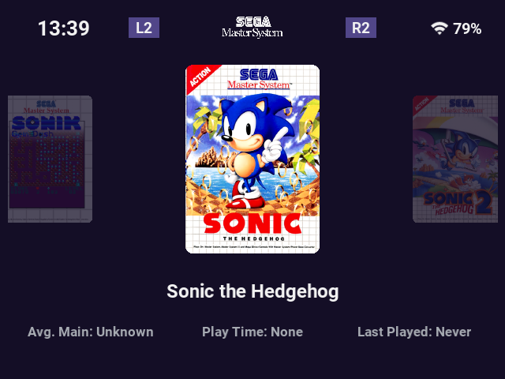

<p align="center">
  <a href="./demo.png">
    
  </a>
</p>

<h1 align="center">Focus theme for EmulationStation</h1>

## About

Focus is a dark, minimal EmulationStation theme designed around a native
three-game horizontal carousel. It is based on
[Art Book Next](https://github.com/anthonycaccese/art-book-next-es) and adapts
that foundation into a handheld-friendly interface with a fixed status bar,
purple accents, large cover artwork, and compact play statistics.

The layout was developed and tested primarily on a 640×480 (4:3) ROCKNIX
handheld. Aspect-ratio definitions for 16:9, 16:10, 4:3, 3:2, and 1:1 are also
included.

## Highlights

- Native three-item GameCarousel with a larger selected cover and faded
  neighbouring games.
- Smooth left/right movement between games.
- Rounded cover artwork that fills its available area without gray bars.
- Light-purple fallback title cards for games without cover artwork.
- Fixed top bar with clock, Wi-Fi status, battery percentage, platform logo,
  and L2/R2 platform-switch hints.
- Root Library carousel for platforms, Favorites, Tools, Ports, and other
  collections, using the included Outline artwork set.
- Dark plum background with subtle translucent purple selection panels.
- Borderless, transparent-button main menus using the same purple palette.
- Bottom help bar hidden for a cleaner layout.
- Game title plus **Avg. Main**, **Play Time**, and **Last Played** labels.
- Automatic GameCarousel selection when ROCKNIX's gamelist style is left on
  **Automatic**.
- Optional HLTB metadata helper for average main-story completion times.

## Installation

1. Download or clone this repository.
2. Copy the complete [`focus-es`](./focus-es/) folder to:

   ```text
   /storage/roms/themes/focus-es/
   ```

3. In ROCKNIX, open **Main Menu → User Interface Settings** and select
   **focus-es** as the Theme Set.
4. Leave **Gamelist View Style** on **Automatic**. Focus declares
   `gamecarousel` as its default view.
5. Enable **Quick System Select** to move between platforms with L2/R2.
6. Optionally enable **Start On Gamelist** and choose a **Start On System** to
   boot directly into a platform's games.
7. Restart EmulationStation if the theme does not reload immediately.

An explicitly saved Basic, Detailed, Grid, or Video view overrides the theme's
default. Change the setting back to **Automatic** to restore GameCarousel.

## Controls

| Control | Action |
| --- | --- |
| D-pad Left / Right | Previous or next game |
| L2 / R2 | Previous or next platform |
| A | Launch the selected game |
| B | Return to the root Library carousel |
| Start | Open the main menu |

L2/R2 platform switching is part of ROCKNIX's EmulationStation GameCarousel
implementation. The theme displays those controls but does not remap physical
controller buttons.

## Game metadata

Focus displays three statistics beneath the selected game:

- **Avg. Main** reads the game's `<arcadesystemname>` value.
- **Play Time** reads ROCKNIX's accumulated game time.
- **Last Played** reads ROCKNIX's last-played timestamp and play count.

Play Time and Last Played are maintained by ROCKNIX. Avg. Main is optional and
can be populated with the included
[`HLTB avg main story.sh`](./Ports/HLTB%20avg%20main%20story.sh) port.

See [Ports/README.md](./Ports/README.md) for supported systems, installation,
matching behavior, backups, cache locations, and limitations. The helper uses a
processed HowLongToBeat dataset and does not rely on ScreenScraper for
completion-time data.

## Artwork and fonts

- GameCarousel covers use each game's `thumbnail` metadata.
- Games without a usable thumbnail receive a subtle purple fallback card with
  the game title.
- The root carousel uses the bundled Outline system artwork.
- The theme includes Default and Roboto font options.
- Custom system logos remain supported through the Art Book Next customization
  path used by the selected distribution.

## Credits

- Visual direction inspired by
  [SocketLauncher](https://www.patreon.com/cw/SocketLauncher).
- Theme foundation:
  [Art Book Next](https://github.com/anthonycaccese/art-book-next-es) by
  Anthony Caccese.
- Selected interface assets sourced or adapted from
  [P-10 Menu for ES-DE](https://github.com/anthonycaccese/p-10-menu-es-de) by
  Anthony Caccese.
- System-logo sources and additional upstream asset credits are retained from
  Art Book Next.
- Metadata icons are sourced from [Font Awesome](https://fontawesome.com/).

Focus is an independent community theme and is not affiliated with
SocketLauncher or HowLongToBeat.

## License

This derivative is distributed under the original theme's
[Creative Commons BY-NC-SA 2.0](https://creativecommons.org/licenses/by-nc-sa/2.0/)
license. You may share and adapt it with attribution, for non-commercial use,
and under the same license terms.
